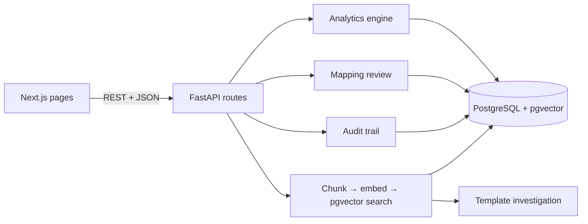
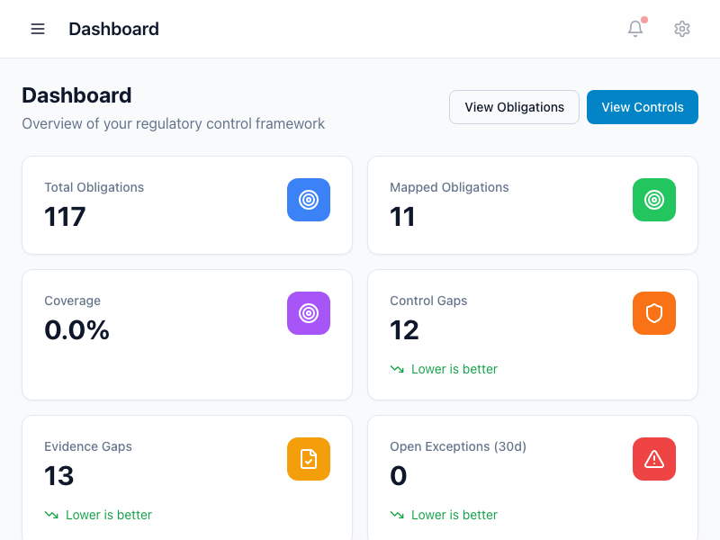
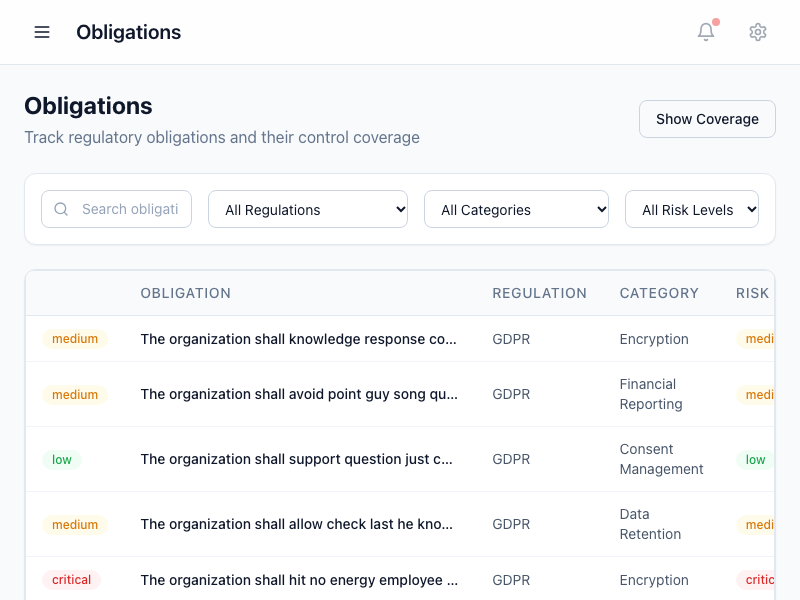
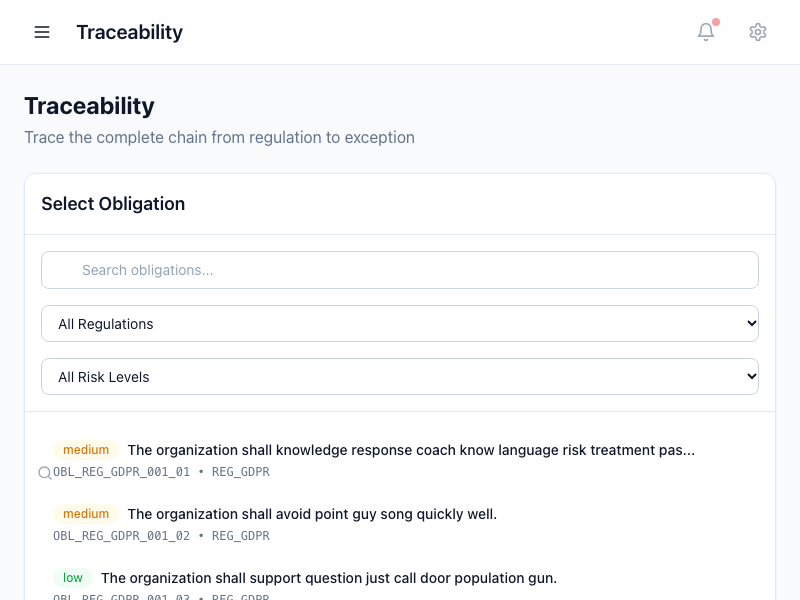
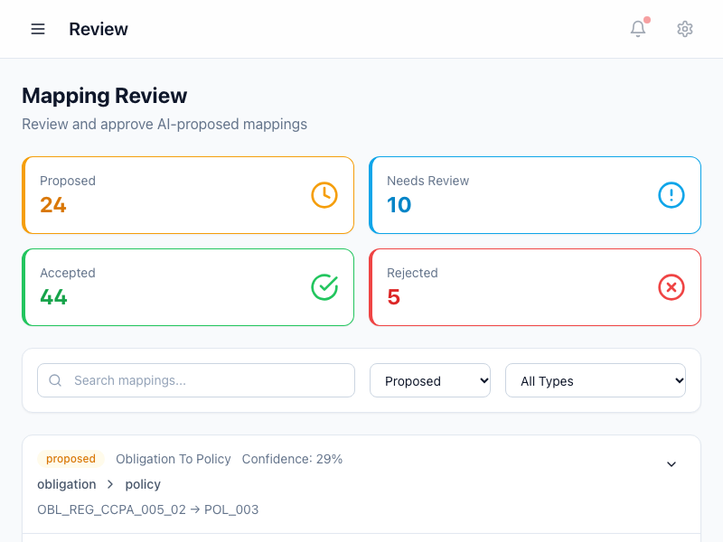
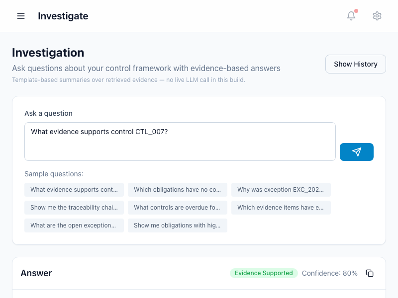

# ControlLens

A regulatory and control intelligence app. It links regulations to the obligations, policies, processes, controls, evidence, transactions, exceptions, and risks that come from them, so you can trace any requirement end to end and see where coverage is weak.

I built this as a portfolio project to practice full-stack development with data engineering, SQL analytics, embeddings, and retrieval. All demo data is synthetic.

## Project Architecture

The Next.js pages call the FastAPI backend over REST (`NEXT_PUBLIC_API_URL`, axios client in `frontend/src/lib/api.ts`). FastAPI routes in `backend/app/main.py` read and write compliance records through SQLAlchemy models (`backend/app/db/base.py`) in PostgreSQL, with pgvector columns for embeddings. Analytics (`AnalyticsEngine`) compute coverage and gaps in Python/SQL; mapping decisions go through `mapping_reviews` with human accept/reject and append to `audit_events`; documents flow through parsing, chunking, MiniLM embedding, and pgvector similarity search; investigation reuses the same tools and retrieval, then fills a summary template.



The compliance chain the app traces:

Regulation → Obligation → Policy → Process → Control → Evidence, with Transaction, Exception, and Risk attached along the way.

## How it works

- **Traceability chain.** Regulation → obligation → policy → process → control → evidence, plus linked transactions, exceptions, and risk assessments. The Traceability page renders the full chain for any mapped obligation (try `OBL_REG_BASL3_004_02`). Unmapped obligations show an honest empty state instead of an error.
- **Deterministic analytics.** Coverage, control gaps, evidence completeness and freshness, exception stats, risk exposure, and gap findings are computed in Python/SQL. No language model is involved in the math. The dashboard shows 117 obligations, 11 with policy links, 0% fully covered, and 180 gap findings.
- **Document retrieval.** Policy and regulation texts are split into chunks (~500 characters, 100 overlap), embedded with `all-MiniLM-L6-v2` (384 dimensions), stored in PostgreSQL with pgvector (HNSW cosine index), and searched by vector similarity plus metadata filters. Every hit keeps its document, section, and page metadata.
- **Human review.** Proposed mappings start as `proposed` and only change when a person accepts, rejects, or asks for more info. Each decision is written to the audit trail.
- **Investigation.** Asking a question runs keyword routing over the same deterministic tools and retrieval above, then composes a short **template-based summary** of the evidence found. There is no live LLM call in this build — the page says so directly.

## Tech stack

Python, FastAPI, SQLAlchemy, PostgreSQL 16, pgvector, Sentence Transformers, Next.js 14, React 18, TypeScript, Tailwind CSS. A `docker-compose.yml` is included in the repo but was not exercised here (no Docker daemon in my environment).

## Demo data

Everything is fictional, generated with Faker (seed 42) by `backend/scripts/generate_data.py`, which reproduces these exact counts on a fresh database:

- 5 regulations, 40 sections, 117 obligations
- 12 policies, 15 processes, 20 controls, 27 control owners
- 16 evidence records, 500 transactions, 30 exceptions
- 48 risk assessments, 83 mappings (44 accepted, 24 proposed, 10 needs review, 5 rejected), 100 audit events
- 12 documents, 1,003 chunks, all with 384-dimensional embeddings (882 via `backend/scripts/backfill_embeddings.py`)

Note that generated obligation text and document paragraphs are filler, and seed dates are from 2023–2024. That is why the Exceptions page defaults to an "All time" view and some evidence shows as expired — the app is reporting the data honestly, not broken.

On labels: "180 gaps" counts overlapping findings by type (114 obligation-coverage, 12 missing-evidence, 20 stale-evidence, 20 overdue-testing, 14 open-exception), not 180 separate items. "Open Exceptions (30d)" counts open items from the last 30 days; older open exceptions exist in the data.

## Run it locally

You need Python 3.11, Node 20, and PostgreSQL 16 with the pgvector extension. The backend and frontend run in two terminals.

```bash
git clone https://github.com/sankethvarma1/Controllens.git
cd Controllens
cp .env.example .env
```

### 1. Database

```bash
createdb -O controllens controllens controllens_test
psql -d controllens -c "CREATE EXTENSION IF NOT EXISTS vector;"
psql -d controllens_test -c "CREATE EXTENSION IF NOT EXISTS vector;"
```

Tables are created by the app on startup. Reference DDL lives in `backend/app/db/schema.sql`.

### 2. Seed data and embeddings

```bash
cd backend
pip install -r requirements.txt
python3 scripts/generate_data.py
python3 -c "
from app.db.base import SessionLocal
from app.services.document_pipeline import ingest_sample_documents
db = SessionLocal(); print(len(ingest_sample_documents(db)), 'sample docs ingested')"
python3 scripts/backfill_embeddings.py
```

Use `sentence-transformers==3.0.1` with `transformers==4.41.2` and `torch==2.1.2` as pinned in `requirements.txt`; newer transformers releases break on torch 2.1.

### 3. Backend (terminal 1)

```bash
cd backend
python3 -m uvicorn app.main:app --host 127.0.0.1 --port 8001
```

- Health: http://localhost:8001/health
- API docs: http://localhost:8001/api/v1/docs

Port 8001 is used because 8000 was already taken on my machine. The backend allows the frontend origin explicitly for local review (see `CORS_ORIGINS` in `backend/app/core/config.py`).

### 4. Frontend (terminal 2)

```bash
cd frontend
npm install
NEXT_PUBLIC_API_URL=http://localhost:8001/api/v1 npx next dev --port 3002
```

- Dashboard: http://localhost:3002/dashboard

Port 3002 is used because 3000 was already taken locally.

## Tests and checks

```bash
cd backend
python3 -m pytest tests/test_core.py -q
```

15 tests pass: database CRUD, analytics math, retrieval with stubbed query vectors, traceability chains, agent tools, and evidence attribution. Retrieval tests stub the query embedding so the suite runs offline; live retrieval with real embeddings was verified separately against the seeded database.

```bash
cd frontend
npx tsc --noEmit
npm run build
```

Type-check is clean and the production build succeeds (12 routes).

## Limitations

- All data is synthetic, and generated document paragraphs are filler; seed dates are from 2023–2024, so some views default to "All time" and older evidence shows as expired.
- Investigation summaries are template based, not produced by a live LLM.
- No user accounts or authentication; single-tenant demo. Retrieval is vector similarity plus metadata filtering, with no reranker or entailment check.

## License

MIT — see [LICENSE](LICENSE).

## Screenshots






